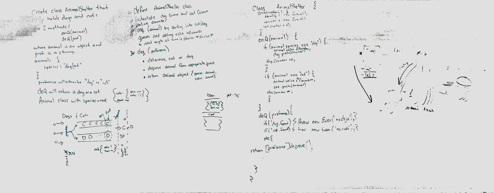

# Implement a Queue using two Stacks.
Create a manual queue using 2 stacks. Paired with Fletcher LaRue and Jacob Anderson.  

## Challenge
* Create a class called AnimalShelter which holds only dogs and cats. The shelter operates using a first-in, first-out approach.
#### Implement the following methods:
* enqueue(animal): adds animal to the shelter. animal can be either a dog or a cat object.
* dequeue(pref): returns either a dog or a cat. If pref is not "dog" or "cat" then return null.

## Approach & Efficiency
* With timebox constraints, we collaboratively whiteboarded and shared code.  We have strtch goal implementation, but at end of timbox do not have 100% working / test passing code.  This will happen shortly
## Solution
;