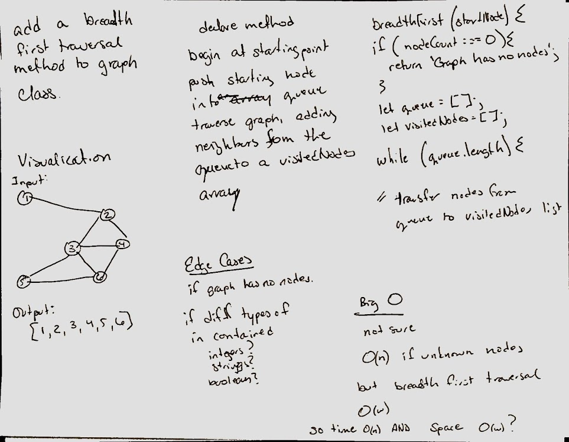

# Graphs
* A graph is a non-linear data structure that can be looked at as a collection of vertices (or nodes) potentially connected by line segments named edges.

* Common terminology used when working with Graphs:

  * Vertex - A vertex, also called a “node”, is a data object that can have zero or more adjacent vertices.
  * Edge - An edge is a connection between two nodes.
  * Neighbor - The neighbors of a node are its adjacent nodes, i.e., are connected via an edge.
  * Degree - The degree of a vertex is the number of edges connected to that vertex

## Challenge
* Implementation of Graph. The graph represents an adjacency list, and includes the following methods:
  * 

## Approach & Efficiency
Utilizes the Single-responsibility principle: any methods written are clean, reusable, abstract component parts of the whole challenge. 

## API
1. AddNode()
    * Adds a new node to the graph
    * Takes in the value of that node
    * Returns the added node
2. AddEdge ()
    * Adds a new edge between two nodes in the graph
    * Include the ability to have a “weight”
    * Takes in the two nodes to be connected by the edge
    * Both nodes should already be in the Graph
3. GetNodes()
    * Returns all of the nodes in the graph as a collection (set, list, or similar)
4. GetNeighbors()
    * Returns a collection of nodes connected to the given node
    * Takes in a given node
    * Include the weight of the connection in the returned collection
5. Size()
    * Returns the total number of nodes in the graph

# Breadth-First Traversal of a Graph
* Implement a breadth-first traversal on a graph.

## Challenge
* Extend graph object with a breadth-first traversal method that accepts a starting node.

## Approach & Efficiency
* Due to weather, we were not at school and partnered like normal.  instead of a whiteboard activity I have made attempt to diagram on paper.   
* Whiteboard wasn't the most productive, leaned on VInicio's reference code for this one

## Solution
