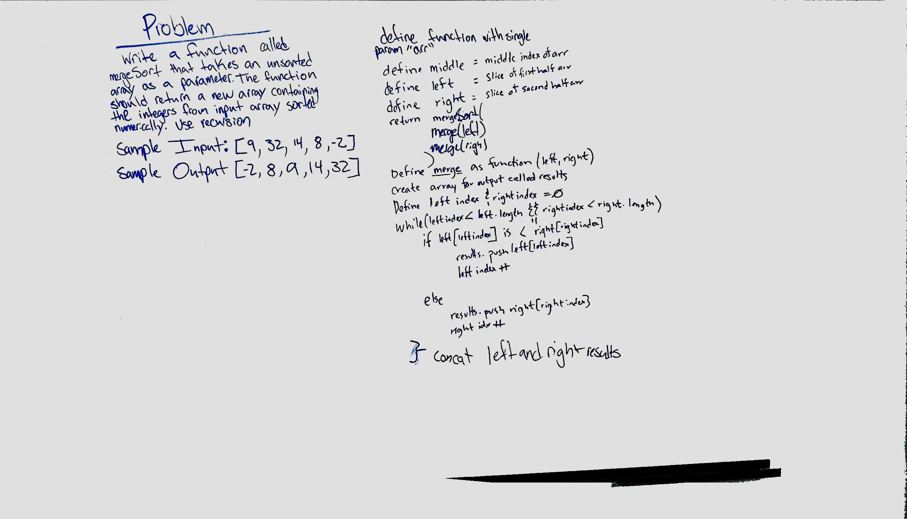

# Mergesort
* Implement Mergesort.
## Challenge
* Write a function that accepts an array of unsorted integers, and returns a sorted array by a recursive mergesort algorithm.
## Approach & Efficiency
* Without a specific reading available for this challenge, we resorted to Google.  I was paired with Michael George and George Raymond.  The solution we found was very closely mirrored from a resource found by Tanner Seramur and Jacon Anderson.
* As per instruction, we recognize that this is a very common search pattern that simply needs to be committed to memory

## Solution
