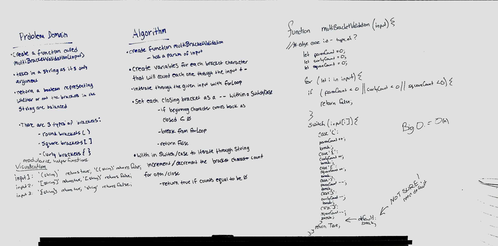

# Multi-bracket Validation.
Code Challenege 13, paired with Siobhan Neiss

## Challenge
* Our function takes a string as its only argument, and  returns a boolean representing whether or not the brackets in the string are balanced. There are 3 types of brackets:

  * Round Brackets : `()`
  * Square Brackets : `[]`
  * Curly Brackets : `{}`

## Approach & Efficiency
Siobhan Neiss keyed in code and I wrote tests.  observed timebox for initial submission

## Solution
