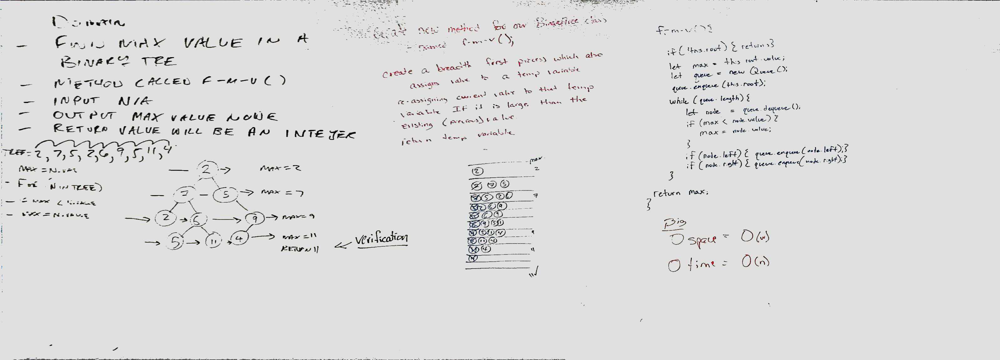

# Trees
Code CHallenge 11: Binary Trees
## Challenge
Code Challenge 17 - Breadth First Paired With Lena Eivy creates a method on the BinaryTree class.  it calls a tree, and returns a breadth first list of values returned in an array
## Approach & Efficiency
challenge 17 went well

## API
* Breadth First

## Challenge
Code Challenge 18 - Write a function called `find-maximum-value` which takes binary tree as its only input. Without utilizing any of the built-in methods available to your language, return the maximum value stored in the tree. You can assume that the values stored in the Binary Tree will be numeric.
## Approach & Efficiency
challenge 18 went well, paired with Jon DiQuattro and Fletcher Larue

## API
* Breadth First
