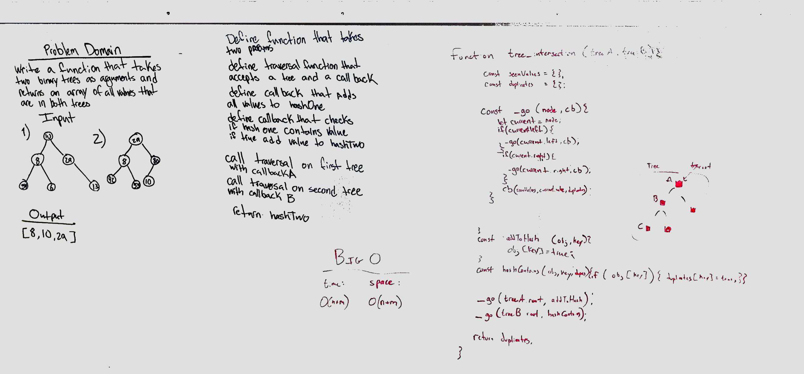

# Intersection of binary trees
* Collaborated with George Raymond and Fletcher LaRue
* Use hashtable to determine whether or not values in two different binary trees is duplicated

## Challenge
* Write a function called `tree_intersection` that takes two binary tree parameters.
* Without utilizing any of the built-in library methods available to your language, return a set of values found in both trees.

## Approach & Efficiency
* first tree is assigned to a hashtable.  the second tree is compared to the first hashtable and if it exists, that value is also assigned to a second hashtable
## Solution

