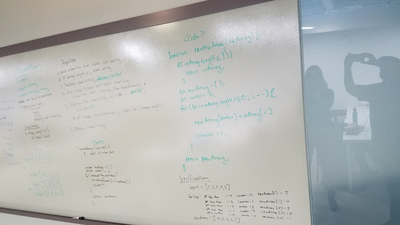
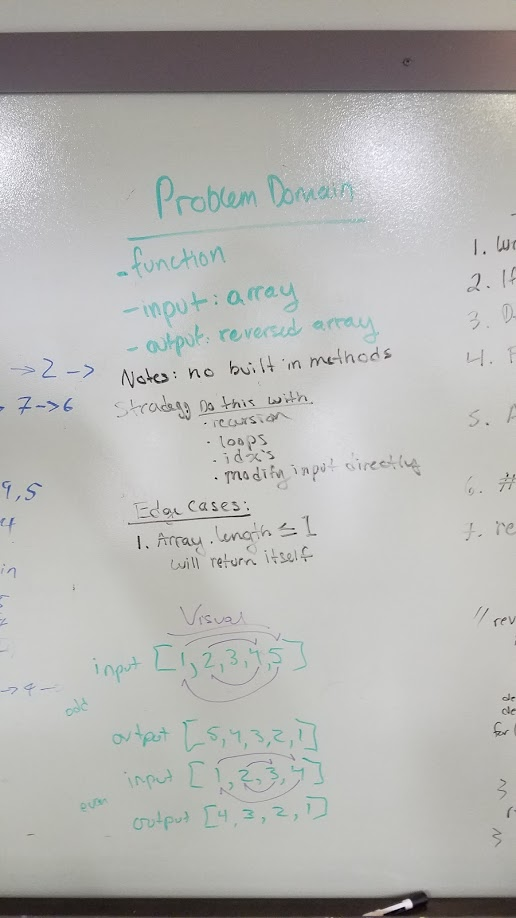
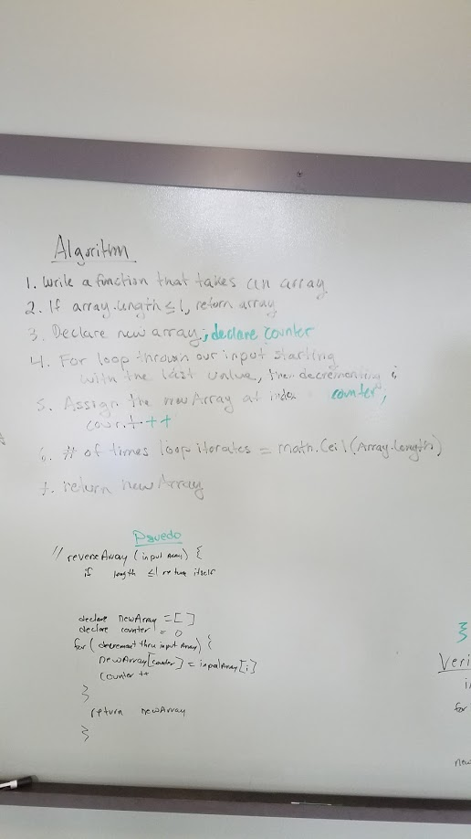
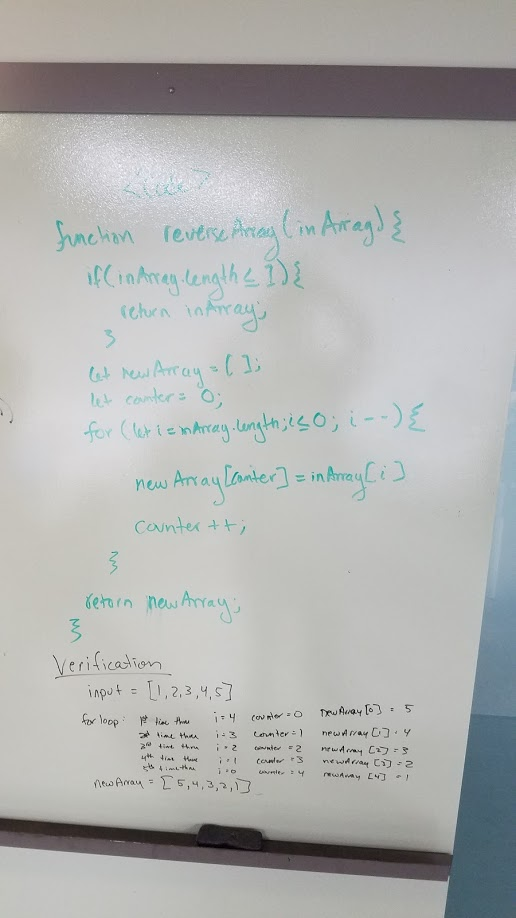

# Reverse an Array
<!-- Short summary or background information -->
Code Challange 01: Reverse an array 
paired with Hannah Ingham

## Challenge
<!-- Description of the challenge -->
Write a function called reverseArray which takes an array as an argument. Without utilizing any of the built-in methods available to your language, return an array with elements in reversed order.

## Approach & Efficiency
We created a new arrary, and a counter in order to assign the value at the specific index into the new array at the appropriate new index.
<!-- What approach did you take? Why? What is the Big O space/time for this approach? -->

## Solution
<!-- Embedded whiteboard image -->

