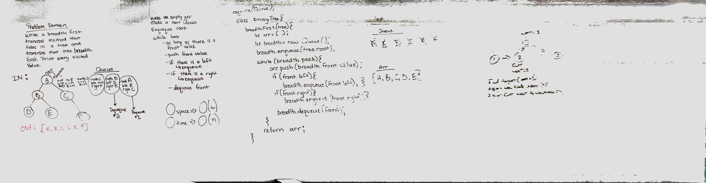

# Trees
Implementation of Binary Tree and Binary Search Tree.

#### Binary Tree Class:
* parent node contains no more than two children and nodes are *not* added with any specific sorting order; a node can be added wherever there is room.

#### Binary Search Tree Class:
* parent node contains no more than two children and nodes *are* added with a specific sorting order; a node larger than the root is sorted to the right and smaller to the left.

## Approach & Efficiency
#### Binary Tree:
* The Big O time of an insertion and searching will always be O(n).
* This is because there is no structure or organization to a Binary Tree. In the worst case scenario, we will have to search the whole tree for the specified value, or the place where we want to insert a new node.
* The Big O space for a node insertion using breadth first will be an O(w), with “w” being largest width of the tree. This is because at the worst case scenario, the queue will contain all of the nodes at the tree’s widest point. The maximum width, for a “perfect” binary tree, is 2^(H-1), where H is the height of the tree. Height can be calculated as lg n. Drawing a small example reveals the pattern very quickly.

#### Binary Search Trees:
* The Big O of insertion and search operations is O(h), or O(height). In the worst case, we will have to search all the way down to a leaf, which will require searching through as many nodes as the tree is tall. In a balanced tree, the height of the tree is lg(n); in an unbalanced tree, the worst case height of the tree is n.

* The Big O space of a search would be O(1). During the search, we are not allocating any additional space when searching for a node.

## API
Binary Tree Methods:
* `preOrder();`
  * records the node value *before* recursing to the left and the right of node.
  * to run:  `tree.preOrder();`
    * input:  none, chaining method on the tree.
    * output: returns an appropriately sorted array of values
* `inOrder();`
  * records the node value *after* recursing to the left and *before* recursing to the right of node.
  * to run:  `tree.inOrder();`
    * input:  none, chaining method on the tree.
    * output: returns an appropriately sorted array of values
* `postOrder();`
  * records the node value *after* recursing to the left and the right of node.
  * to run:  `tree.preOrder();`
    * input:  none, chaining method on the tree.
    * output: returns an appropriately sorted array of values
* `breadthFirst();`
  * Enqueues all tree nodes starting with tree.root.  While queue.front, method continues to the node's left child and right child, then dequeues the evaluated node, pushing that evaluated node's value into a results array.
  * to run:  `tree.breadthFirst();`
    * input:  none, chaining method on the tree.
    * output: returns an appropriately sorted array of values
* `findMaximumValue();`
  * Evaluates node before recursing left and right, changing the `max` variable at each evauation point if node value is greater.
  * to run: `tree.findMaximumValue();`
    * input:  none, chaining method on the tree.
    * output: greatest node value found in tree.  
--------------
## Challenge Summary
Code Fellows Code Challenge 17 - Breadth First Traversal, paired With Lena Eivy.
### Challenge Description
Create a breadth first method on the BinaryTree class.  This method chains onto a tree, and returns an array with the apropriately sorted node values.
## Approach & Efficiency
The breadth first traversal iterates through the tree by going through each level of the tree node by node, leveraging a queue to traverse the width of the tree.  
* Big O time of the search is 0(n); all nodes, an unknown quantity, must be evaluated.
* Big O space for a node insertion using breadth first will be an O(w), with “w” being largest width of the tree.
### Solution

-------------
## Challenge Summary
Code Challenge 18 - Find Maximum Value, paired with Jon DiQuattro and Fletcher LaRue. 
### Challenge Description
Create a find maximum value method on the BinaryTree class.  This method chains onto a tree, and returns the highest node value contained within.
## Approach & Efficiency
The find max value method evaluates the root node  changing the max variable if the node value is greater, then recurses left changing changing the max variable if the left node value is greater, then recurses right changing the max variable if the right node value is greater. Once every node in the tree has been evaluated, the method returns the max value.
* Big O time of the search is 0(n); all nodes, an unknown quantity, must be evaluated.
### Solution
