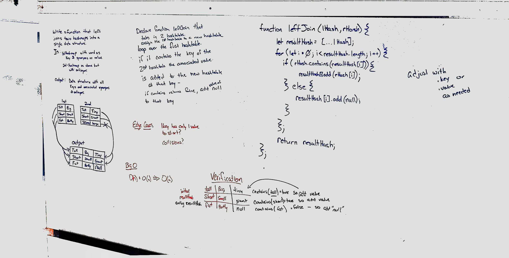

# Left Join for 2 hashmaps:
* Collaborated with Brent Woodward
* use hashtables left join two hashtables

## Challenge
* Write a function that LEFT JOINs two hashmaps into a single data structure.
* The first parameter is a hashmap that has word strings as keys, and a synonym of the key as values.
* The second parameter is a hashmap that has word strings as keys, and antonyms of the key as values.
* Combine the key and corresponding values (if they exist) into a new data structure according to LEFT JOIN logic.
* LEFT JOIN means all the values in the first hashmap are returned, and if values exist in the “right” hashmap, they are appended to the result row. If no values exist in the right hashmap, then some flavor of NULL should be appended to the result row.
* The returned data structure that holds the results is up to you. It doesn’t need to exactly match the output below, so long as it achieves the LEFT JOIN logic.
* Avoid utilizing any of the library methods available to your language.

## Approach & Efficiency
* copy first hashtable, if it contains the key from the 2nd hashtable then the coorresponding value is added to the copy of the first hashtable.  If the key does not exist, then we add the value of null to the corrseponding key.  this copy is then returned to complete the task.
## Solution
