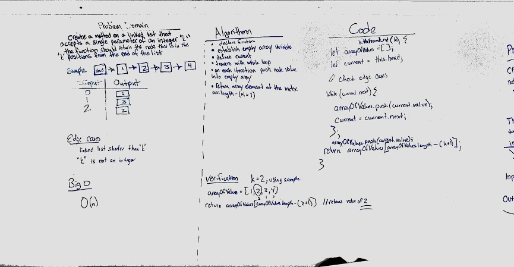

# Singly Linked List
*Create a Node class and Linked List class with methods

## Challenge
* Create a Node class that has properties for the value stored in the Node, and a pointer to the next Node.
* Within your LinkedList class, include a head property. Upon instantiation, an empty Linked List should be created.
* This object should be aware of a default empty value assigned to head when the linked list is instantiated.

## Approach & Efficiency
* Created Node Class and Linked List class. 

## Write the following methods for the Linked List class:
* Define a method called insert which takes any value as an argument and adds a new node with that value to the head of the list with an O(1) Time performance.
* Define a method called includes which takes any value as an argument and returns a boolean result depending on whether that value exists as a Node’s value somewhere within the list.
* Define a method called print which takes in no arguments and outputs all of the current Node values in the Linked List.

## Methods Added
* `insert(value);`
* `includes(value);`
* `print();`

-------------------------------------------------------------------
-------------------------------------------------------------------
## Code Challenge 06
#### Write the following methods for the Linked List class:
* .append(value) which adds a new node with the given value to the end of the list
* .insertBefore(value, newVal) which add a new node with the given newValue immediately before the first value node
* .insertAfter(value, newVal) which add a new node with the given newValue immediately after the first value node
## Approach & Efficiency
* Paired with Jon DiQuattro.  Being stronger on linked lists than I (at the time), this was a great experience.  I was able to learn a significant amount.

## Methods Added
* `append(value);`
* `insertBefore(value, newVal);`
* `insertAfter(value, newVal);`

## Solution

------------------------------------------------------------------
------------------------------------------------------------------

## Code Challenge 07
Write a method for the Linked List class which takes a number, k, as a parameter. Return the node’s value that is k from the end of the linked list. You have access to the Node class and all the properties on the Linked List class as well as the methods created in previous challenges.

## Approach & Efficiency
* Paired with George Raymond.  We came up with a different approach than others.  Ours seems to be a clean and efficient solution.

## Method Added
* `kthFromEnd(k);`

## Solution
