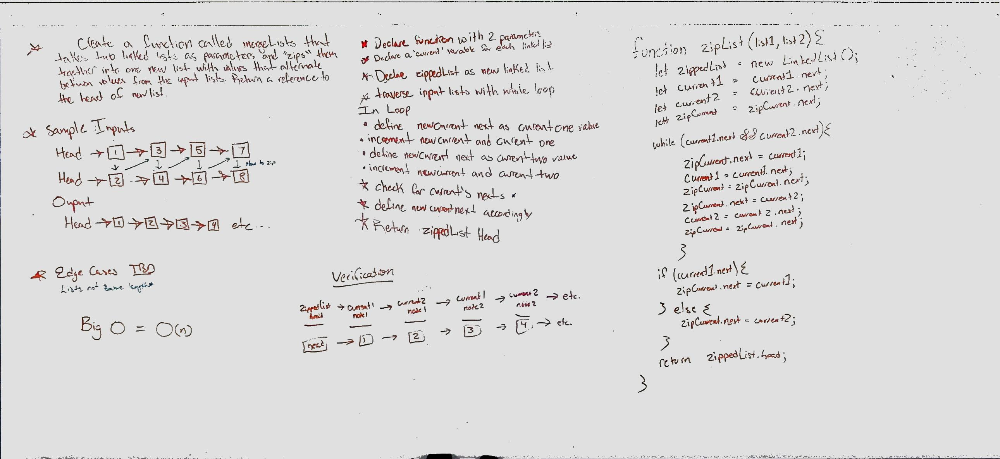

# Merge two Linked Lists
Code Challenge 08: Paired with George Raymond

## Challenge
Write a function named mergeLists that takes in two linked lists as parameters and 'zips' them together into one new list with values that alternate between values of the input lists, returning a refrence to the head of new list.

## Approach & Efficiency
We worked through a logical solution, which initially didn't work.  Not the most efficient, but this process gets us closer and will lead us to full functionality

## Solution
