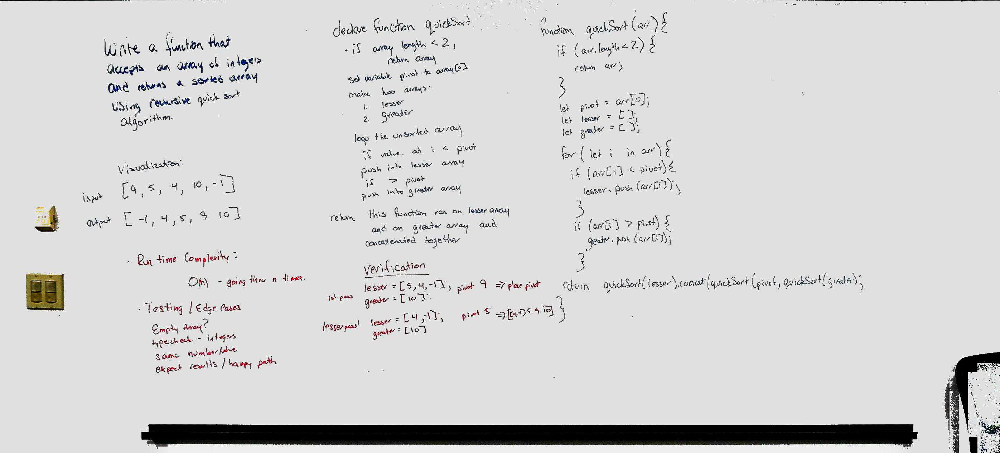

# Quicksort
Implement Quicksort.

## Challenge
Write a function that accepts an array of integers, and returns an array sorted by a recursive quicksort algorithm.

## Approach & Efficiency
Paired with Lena Eivy, we found a number of online examples.  This challenge is a staple in the developer's toolbelt, and the standard answer is something to remember -and understand!  Nick, an instructor at code fellows, recommended the [Quick SOrt Hungarian Dance](https://www.youtube.com/watch?v=ywWBy6J5gz8).  I found this helpful, because it shows that the points of interet are the pivot points.  These points are placed in order and everything in between is then also recursively ordered / placed as pivot points with the remaining values falling into their proper places.

## Solution
