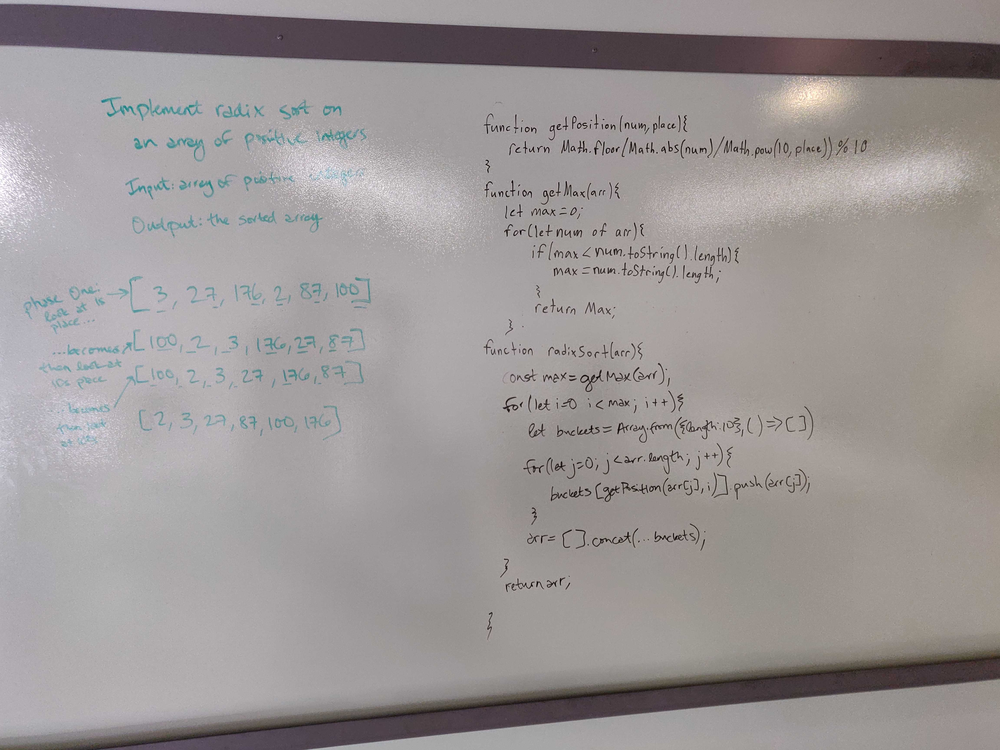

# Quicksort
Implement radix sort.
## Challenge
Write a function that accepts an array of positive integers, and returns an array sorted by a radix sort algorithm.
## Approach & Efficiency
WOrked with Becca Lee and Jacob anderson.  We relied heavily on google as a resource, specifically: https://reactgo.com/radix-sort-algorithm-javascript/
## Solution
